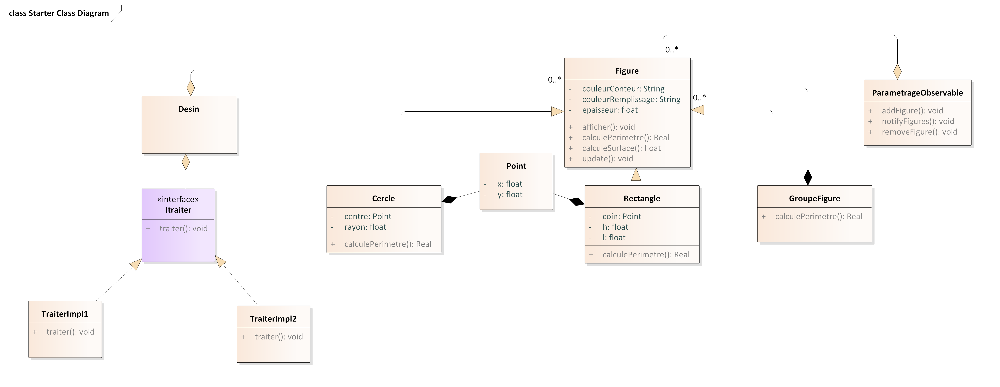
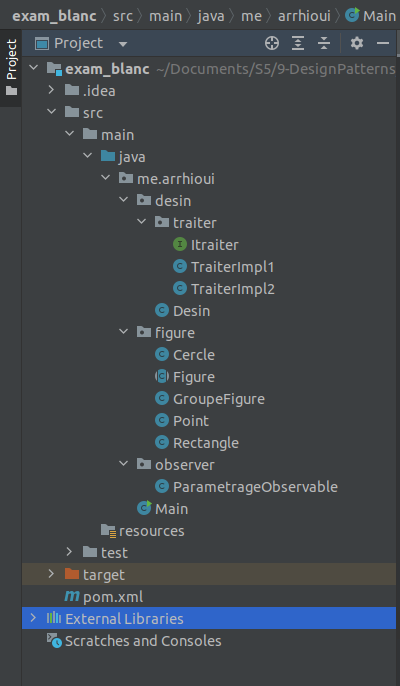

# Diagramme de classe du modèle
Dans le diagramme de classe suivant nous avons utilisé plusieur design pqtterns, à savoir:
- Composite : Le but d'utiliser les pattern Composite est de resoudre le probleme qu'un groupe de figure peut contenir plusieur autre figures. Cela va etre utile au moment de l'affichage d'un groupe de figure, aui contient les figures et d'autres groupe de figure. Avec Composite, il sufit de mettre en place une fonction récursive et a chaque foit on fait un vérification si la figure courante et une instance de GroupeFigure a l'aide de l'opérateur insteceof.
- Observer : Pour que les fugures soient notifiés qu moment du changement de l'objet de paramétre, nous avons mise en place la pattern Observer, ou le les observers sont les figures et l'observable est l'objet parametrage. a chaque fois qu'une propriété du parametrage change, on appel la methode update des observers en pace en parametre l'objet parametrage, donc c'est du push.
- Strategy: Pour donner la possibilité à l'utilisateur de changer l'algorithme de traitement du desing, nous avons mise en place le pattern strategy. Cela va garantir un changement de la strategie au momment de l'execution de l'application, et aussi il grantie une evolution de l'algorithme dans le future. 




# Implémentation du modèle en utilisant un projet Maven




## Class Figure
```java
package me.arrhioui.figure;

import me.arrhioui.observer.ParametrageObservable;

public abstract class Figure {

    protected String couleurConteur = "Noir";
    protected String coulleurRemplissage = "Blanc";
    protected float epaisseur;

    public void afficher(){
        System.out.println("epaisseur = " + epaisseur);
        System.out.println("couleurConteur = " + couleurConteur);
        System.out.println("coulleurRemplissage = " + coulleurRemplissage);
    }
    abstract public float calculePerimetre();
    abstract public float calculeSurface();

    public void update(ParametrageObservable parametrageObservable){
        this.epaisseur = parametrageObservable.getEpaisseur();
        this.couleurConteur = parametrageObservable.getCouleurConteur();
        this.coulleurRemplissage = parametrageObservable.getCoulleurRemplissage();
    }
}
```

## Class Point

```java
package me.arrhioui.figure;

public class Point {
    private float x;
    private float y;

    public Point(float x, float y) {
        this.x = x;
        this.y = y;
    }

    public Point() {
    }

    public float getX() {
        return x;
    }

    public void setX(float x) {
        this.x = x;
    }

    public float getY() {
        return y;
    }

    public void setY(float y) {
        this.y = y;
    }

    @Override
    public String toString() {
        return "{" +
                "x=" + x +
                ", y=" + y +
                '}';
    }
}

```

## Class Cercle

```java
package me.arrhioui.figure;

import me.arrhioui.observer.ParametrageObservable;

public class Cercle extends Figure{
    private Point c;
    private float r;

    public Cercle(Point c, float r) {
        this.c = c;
        this.r = r;
    }

    @Override
    public void afficher() {
        System.out.println("------------------------------------------------------------------");
        System.out.println("I'm a cercle, my center is "+ c+", and my radius is "+ r);
        super.afficher();
        System.out.println("------------------------------------------------------------------");
    }

    @Override
    public float calculePerimetre() {
        return (float) (2 * Math.PI * r);
    }

    @Override
    public float calculeSurface() {
        return (float) (Math.PI * Math.pow(r, 2));
    }

}

```

## Class Rectangle

```java
package me.arrhioui.figure;

import me.arrhioui.observer.ParametrageObservable;

public class Rectangle extends Figure{
    private Point coin;
    private float h;
    private float l;

    public Rectangle(Point coin, float h, float l) {
        this.coin = coin;
        this.h = h;
        this.l = l;
    }

    @Override
    public void afficher() {
        System.out.println("------------------------------------------------------------------");
        System.out.println("I'm a rectangle, my edge is +"+coin+ ", height " + h + " and my width is " + l);
        super.afficher();
        System.out.println("------------------------------------------------------------------");
    }

    @Override
    public float calculePerimetre() {
        return 2*(h+l);
    }

    @Override
    public float calculeSurface() {
        return l*h;
    }


}

```

## Class GroupeFigure

```java
package me.arrhioui.figure;

import java.util.ArrayList;
import java.util.List;

public class GroupeFigure extends Figure{

    private List<Figure> childFigures = new ArrayList<>();

    @Override
    public void afficher() {
        afficher(childFigures);
    }

    private void afficher(List<Figure> groupeFigure){
        for (Figure figure: groupeFigure) {
            if(figure instanceof  GroupeFigure)
                afficher(((GroupeFigure) figure).childFigures);
            else
                figure.afficher();
        }
    }

    @Override
    public float calculePerimetre() {
        return calculePerimetre(childFigures);
    }

    public float calculePerimetre(List<Figure> groupeFigure) {
        float perimetre = 0;
        for (Figure figure: groupeFigure) {
            if(figure instanceof  GroupeFigure)
                afficher(((GroupeFigure) figure).childFigures);
            else
                perimetre += figure.calculePerimetre();
        }
        return perimetre;
    }

    @Override
    public float calculeSurface() {
        return calculeSurface(childFigures);
    }

    public float calculeSurface(List<Figure> groupeFigure) {
        float surface = 0;
        for (Figure figure: groupeFigure) {
            if(figure instanceof  GroupeFigure)
                afficher(((GroupeFigure) figure).childFigures);
            else
                surface += figure.calculeSurface();
        }
        return surface;
    }

    public void addFigure(Figure figure){
        this.childFigures.add(figure);
    }

    public void removeFigure(Figure figure){
        this.childFigures.remove(figure);
    }


}

```

## Class ParametrageObservable

```java
package me.arrhioui.observer;

import me.arrhioui.figure.Figure;

import java.util.ArrayList;
import java.util.List;

public class ParametrageObservable {

    private String couleurConteur;
    private String coulleurRemplissage;
    private float epaisseur;
    private List<Figure> figures = new ArrayList<>();

    public ParametrageObservable() {
        this.couleurConteur = "Noir";
        this.coulleurRemplissage = "Blanc";
        this.epaisseur = 1;
    }

    public void addFigure(Figure figure) {
        this.figures.add(figure);
    }

    public void removeFigure(Figure figure) {
        this.figures.remove(figure);
    }

    public void notifyFigure() {
        for (Figure figure : figures) {
            figure.update(this);
        }
    }

    public String getCouleurConteur() {
        return couleurConteur;
    }

    public void setCouleurConteur(String couleurConteur) {
        this.couleurConteur = couleurConteur;
        this.notifyFigure();
    }

    public String getCoulleurRemplissage() {
        return coulleurRemplissage;
    }

    public void setCoulleurRemplissage(String coulleurRemplissage) {
        this.coulleurRemplissage = coulleurRemplissage;
        this.notifyFigure();
    }

    public float getEpaisseur() {
        return epaisseur;
    }

    public void setEpaisseur(float epaisseur) {
        this.epaisseur = epaisseur;
        this.notifyFigure();
    }
}

```

## Interface ITraiter

```java
package me.arrhioui.desin.traiter;


import me.arrhioui.figure.Figure;

import java.util.List;

@FunctionalInterface
public interface Itraiter {
    void traiter(List<Figure> figures);
}

```

## Class TraiterImpl1

```java
package me.arrhioui.desin.traiter;

import me.arrhioui.figure.Figure;
import java.util.List;

public class TraiterImpl1 implements Itraiter {
    @Override
    public void traiter(List<Figure> figures) {
        System.out.println("Algorithm 1 for processing the design");
        System.out.println("figures.size() = " + figures.size());
    }
}

```

## Class TraiterImpl1

```java
package me.arrhioui.desin.traiter;

import me.arrhioui.figure.Figure;
import java.util.List;

public class TraiterImpl1 implements Itraiter {
    @Override
    public void traiter(List<Figure> figures) {
        System.out.println("Algorithm 2 for processing the design");
        System.out.println("figures.size() = " + figures.size());
    }
}

```

# Tests 

```java
package me.arrhioui;

import me.arrhioui.desin.Desin;
import me.arrhioui.desin.traiter.Itraiter;
import me.arrhioui.desin.traiter.TraiterImpl1;
import me.arrhioui.desin.traiter.TraiterImpl2;
import me.arrhioui.figure.*;
import me.arrhioui.observer.ParametrageObservable;

public class Main {

    public static Itraiter algo1 = new TraiterImpl1();
    public static Itraiter algo2 = new TraiterImpl2();
    public static void main(String[] args) {
        ParametrageObservable parametrage = new ParametrageObservable();
        Desin desin = new Desin();

        Figure cercle = new Cercle(new Point(), 10);
        cercle.afficher();


        Figure rectangle = new Rectangle(new Point(), 10, 10);
        rectangle.afficher();

        Figure groupe = new GroupeFigure();
        Figure rectangle2 = new Rectangle(new Point(), 20, 10);
        Figure rectangle3 = new Rectangle(new Point(), 30, 10);

        Figure groupe2 = new GroupeFigure();
        Figure rectangle22 = new Rectangle(new Point(), 20, 10);
        Figure rectangle33 = new Rectangle(new Point(), 30, 10);
        ((GroupeFigure)groupe2).addFigure(rectangle22);
        ((GroupeFigure)groupe2).addFigure(rectangle33);

        ((GroupeFigure)groupe).addFigure(rectangle2);
        ((GroupeFigure)groupe).addFigure(rectangle3);
        ((GroupeFigure)groupe).addFigure(groupe2);

        groupe.afficher();
        System.out.println("Per"+groupe2.calculePerimetre());

        parametrage.addFigure(cercle);
        parametrage.addFigure(rectangle);

        parametrage.setCouleurConteur("Rose");

        desin.addFigure(cercle);
        desin.addFigure(rectangle);
        desin.addFigure(groupe);
        desin.addFigure(groupe2);
        desin.traiter();
        desin.setItraiter(algo2);
        desin.traiter();

        cercle.afficher();
        rectangle.afficher();
    }
}
```